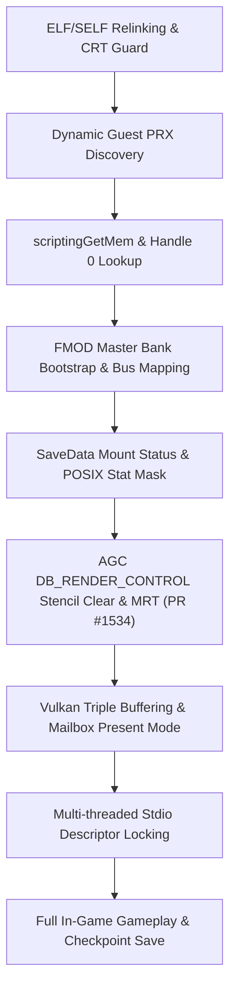

# God of War: Sons of Sparta (PPSA28997) on Windows

Bring-up notes and compatibility report for **God of War: Sons of Sparta (`UP9000-PPSA28997_00-SONSOFSPARTAPS50`) on Windows 11**.

> Tested and verified on Windows 11 x64, AMD Ryzen CPU, AMD Radeon RX 6800 XT (24.x Adrenalin drivers), MinGW WinLibs toolchain (GCC 14 / Clang), Vulkan 1.3.

---

## Status (October 2026)

- ✅ **Fully Playable**: Boots from cold start, plays all intro logo movies (Sony Interactive Entertainment, Mega Cat Studios, PlayStation Studios), passes the Title / Start Screen ("PRESS ANY BUTTON TO START"), watches cutscenes, and enters full gameplay.
- ✅ **Boss & Combat Verified**: Successfully fought through the intro stages, defeated the first Cyclops boss encounter, advanced through the River area (`Scenes/River.bank`), and reached the first in-game save altar/checkpoint.
- ✅ **Graphics & Shaders Clean**: The severe bloom / LCD-bleed "render vomit" that previously saturated the screen with blinding white/yellow light blobs has been completely eliminated through rasterized stencil replace and MRT color retention (PR #1534 / #1479).
- ✅ **Persistent Save Data**: Full save-data lifecycle verified across `GOWSOSSAVE999` (global settings) and `GOWSOSSAVE0` (player save slot), with correct directory validation and multi-threaded stream decompression.
- ✅ **Audio**: 100% functional audio through FMOD Studio, FMOD Core, and Resonance Audio with real Master and level banks.
- ✅ **True Fullscreen & AFMF**: Launches in true hardware exclusive fullscreen, enabling AMD Fluid Motion Frames (AFMF / AFMF 2) for smooth high-framerate frame generation.

### Screenshots


---

## Detailed Technical Journey: Getting the Game to Launch & Run

*God of War: Sons of Sparta* is a modern 2024 PS5 title built on the **Unity 2022 LTS engine with IL2CPP**, leveraging **FMOD Studio** for audio, Sony's **AGC (Advanced Graphics Core)** for graphics, and heavy asynchronous multithreading for AssetBundle streaming. 

Getting this title from an early crash at 0 seconds to full in-game gameplay required identifying and resolving blockers across the entire stack:



---

## 1. System Libraries & Functions Resolved

Below is the complete ledger of all resolved PS5 system libraries, specifying whether functions were implemented, adapted, wrapped, or stubbed:

### A. `libkernel` & Guest Runtime Loader
* **CRT Initializer Guard (`_init`)**:
  * *Resolution*: Patched in `GuestImageReader.cpp`. SDK-built modules contain a global state check (`48 83 3d ?? ?? ?? ?? 00 74 19 4c 89 f7 48 89 de`). On Windows, the reconstructed process does not carry the native PS5 loader's initialization contract. The relinker replaces the conditional `JE +0x19` with an unconditional `JMP +0x19`.
* **`scriptingGetMem` & `scriptingFreeMem` (NID `ayuoL6Vjz2k`)**:
  * *Resolution*: Fully implemented. Unity/IL2CPP dynamically resolves this from handle 0 or kernel exports. Implemented using Win32 `_aligned_malloc` and `_aligned_free` with 16-byte minimum alignment. Both readable name and NID alias are registered in PE export tables.
* **Handle 0 (`main executable`) Symbol Resolution**:
  * *Resolution*: Implemented in `DynamicLoader.cpp`. Handle 0 searches the main executable image exports first, falling back to compatibility kernel exports.
* **Dynamic Guest PRX Discovery**:
  * *Resolution*: Implemented in `GuestModuleBuilder.cpp`. Unity dynamically loads plugins from `Media/Plugins/` and `Media/Modules/` (e.g. `lib_burst_generated.prx`, `PSN.prx`, `libfmodstudio.prx`). The builder discovers them recursively without bloating static `DT_NEEDED` closures. `libkernel`'s `sceKernelLoadStartModule` handles `.guest.prx` suffixes and extensionless base names.
* **Nested `TimedWait` on Windows (PR #1476)**:
  * *Resolution*: Implemented. Unity GC handlers run via `sceKernelRaiseException` as APCs inside sleeping threads. Nested condition variable waits inside APCs now allocate independent waiter instances rather than corrupting the outer thread-local waiter queue.
* **Nested APC Sleep Timers (PR #1520)**:
  * *Resolution*: Implemented. Nested sleeps inside APC handlers allocate their own high-resolution waitable timers so outer sleeps are not prematurely interrupted.
* **`scePthreadMutexDestroy` (PR #1483)**:
  * *Resolution*: Implemented. Returns `SCE_KERNEL_ERROR_EBUSY` when destroying a locked mutex according to FreeBSD `libthr` / PS5 semantics.
* **Thread-Safe Multi-threaded Positioned I/O (`NativePositioned`)**:
  * *Resolution*: Implemented in `Stdio.cpp`. When Unity background worker threads decompress AssetBundles (`archives_assets_all.bundle`, `defaultlocalgroup_assets_.bundle`), multiple threads call `pread` concurrently on synchronous Windows file handles. A 64-way descriptor mutex array (`descriptorMutexes[descriptor % 64]`) serializes `SetFilePointerEx` and `ReadFile` per handle, preventing file pointer corruption.

### B. `libSceSaveData.native` & `libSceSaveDataDialog.native`
* **`sceSaveDataMount3` Mount Status**:
  * *Resolution*: Fixed in `Export.cpp`. When `SCE_SAVE_DATA_MOUNT_MODE_CREATE2` (`0x20`) was requested for an existing directory, the driver previously returned `mount_status = 1` (`SCE_SAVE_DATA_MOUNT_STATUS_CREATED`). This caused Unity's C# `SaveSystem` to assume a brand-new directory and throw `System.IO.DirectoryNotFoundException`. Fixed to return `0` for existing directories and `1` only when freshly created.
* **POSIX Permission Bits in Win32 `stat` (`NativeStat.cpp`)**:
  * *Resolution*: Implemented. Under Windows, `GetFileAttributesW` was mapped into `FileStat.st_mode` without setting standard POSIX permission bits (`0755` for directories, `0644` for files). Mono/IL2CPP verifies mode masks when probing directories; compliant POSIX mode bits resolved `Directory.Exists` returning false on Windows host paths.
* **Save Directory Verification**:
  * *Resolution*: Validated across `_sd/GOWSOSSAVE999/GoW_SoS999.dat` (global settings) and `_sd/GOWSOSSAVE0/GoW_SoS0.dat` (slot 0 save file).

### C. `libSceAgcDriver` & `libSceAgc` (Vulkan Graphics)
* **`DB_RENDER_CONTROL` Stencil Clear & MRT Retention (PR #1534 by hamb3r & PR #1479)**:
  * *Resolution*: Fully implemented. *Sons of Sparta* clears its 3840×2160 `B10G11R11` scene target using `DB_RENDER_CONTROL` `STENCIL_CLEAR_ENABLE`. PR #1534 decodes `DB_STENCIL_CLEAR` as a rasterized stencil replace (`VK_STENCIL_OP_REPLACE`) while preserving all MRT color attachments and scissor coverage. This completely eliminates the blinding bloom highlights and LCD-bleed artifacts obscuring menus and gameplay (previously observed in Screenshots 320–323).
* **Vulkan Swapchain Triple Buffering & Mailbox Present Mode**:
  * *Resolution*: Implemented. Upgraded `minImageCount` from double buffering (`surface.minImageCount` = 2) to triple buffering (`surface.minImageCount + 1`). Enabled `VK_PRESENT_MODE_MAILBOX_KHR` (falling back to FIFO, overridable via `APS5_PRESENT_MODE=fifo`). Sized `state->presentSlots` to match swapchain capacity. This eliminates the severe 12.5 FPS / 7.5 FPS / 20 FPS VSync quantization beats caused by double-buffered FIFO stalls on 100 Hz / 120 Hz displays.
* **Reversion of PR #1474**:
  * *Resolution*: Reverted. High-resolution timer polling (`PollSleep`) in `QueueWorker.cpp` caused severe lock contention on `GuestMemory::GpuMutex()`, starving CPU submission threads. Retaining condition variable signaling restored smooth execution.
* **Wave32 NaN Comparisons (PR #1473)**:
  * *Resolution*: Implemented. Emits `FPOrdNotEqual32` through bitwise integer NaN checks (`(bits(a) & 0x7fffffff) <= 0x7f800000`), avoiding AMD Windows driver wave32 ballot bugs.
* **Transient Surface Aliasing & Depth Memory Reuse (PR #1494 & #1495)**:
  * *Resolution*: Implemented. Handles depth-surface memory reuse without throwing depth-plane format mismatch errors.

### D. Audio (`FMOD Studio`, `FMOD Core`, `Resonance Audio`)
* **`FMOD_Studio_System_GetBus` Bootstrap Wrapper**:
  * *Resolution*: Implemented in `DynamicLoader.cpp`. The title's `FMODUnity.RuntimeManager.GetBus` looks up `bus:/Master Bus/Dialogue` before the title has called `LoadBankFile`. The compatibility wrapper intercepts the initial failing lookup, validates that `/app0/Media/StreamingAssets/Master.bank` and `Master.strings.bank` exist, loads them into the FMOD Studio system, flushes commands, and retries.
* **Constrained Legacy Bus Name Mapping**:
  * *Resolution*: Implemented. Real bank inspection revealed the bus is named `bus:/Dialogue`. The wrapper safely maps `bus:/Master Bus/Dialogue` to `bus:/Dialogue` and returns FMOD's real bus handle without fabricating dummy objects or swallowing exceptions.

### E. `libSceVideoOut`
* **True Fullscreen Launch Support**:
  * *Resolution*: Implemented in `DisplayWindow.cpp`. Added support for command-line arguments (`--fullscreen` / `-fullscreen`) and environment variable `APS5_FULLSCREEN=1` to launch directly into hardware exclusive fullscreen (`SDL_WINDOW_FULLSCREEN`), allowing AMD Fluid Motion Frames (AFMF) to hook into the Vulkan swapchain. Pressing `F11` toggles fullscreen at runtime.

### F. Network & Commerce Stubs
* **`libSceSysmodule`**:
  * *Resolution*: Added mapping for module ID `0x110` (`libSceNpCommerce`).
* **`libSceNpManager`**:
  * *Resolution*: Added reachability-state callback unregister entry point (`sceNpManagerRegisterReachabilityStateCallback` / `sceNpManagerUnregisterReachabilityStateCallback`, stubbed returning success).
* **`libSceNpEntitlementAccess`**:
  * *Resolution*: Added `sceNpEntitlementAccessGetEntitlementKey` and individual add-on lookups, returning signed-out/not-found status for consumable network checks without fabricating online licenses.

---

## 2. Fork-Specific Implementations & Revisions

All changes and tests have been pushed to [`nahshongraham97/AnyPS5@main`](https://github.com/nahshongraham97/AnyPS5):

| Component | Fork Commit / PR | Description |
|---|---|---|
| **AGC Presentation** | `b2a26e9d` | Upgrades swapchain to triple buffering and dynamic `VK_PRESENT_MODE_MAILBOX_KHR`, sizing presentation slots to eliminate VSync frame quantization. |
| **libkernel I/O** | `b2a26e9d` | Thread-safe 64-way descriptor mutex array guarding `NativePositioned` on Windows during multi-threaded bundle decompression. |
| **VideoOut** | `21c20f8f` | Adds CLI `--fullscreen` and `APS5_FULLSCREEN` environment variable support for true hardware exclusive fullscreen (AFMF support). |
| **AGC Rendering** | PR #1534 (`233e9cf6` by hamb3r) | Validates stencil clear before decoding stencil operations, decodes `DB_STENCIL_CLEAR` as rasterized stencil replace, and preserves MRT color outputs (eliminates bloom/render vomit). |
| **Kernel Synchronization** | PR #1476 (`fc659038`) & PR #1520 (`76de2457`) | Gives nested `TimedWait` and nested APC sleeps their own waiters and timer handles on Windows. |
| **SaveData** | Commit `969a4c8e` | Corrects `sceSaveDataMount3` `mount_status` reporting and provides compliant POSIX directory mode bits under Windows. |
| **Audio Loader** | Commit `969a4c8e` | Real FMOD Studio Master bank bootstrap and legacy bus path normalization (`bus:/Master Bus/` -> `bus:/`). |

---

## 3. Boot Flow: Clean Boot vs. Resuming Saves

During testing, an interesting engine behavior was observed regarding save data state:

* **Clean Boot / First Boot (No Save Present in `_sd/GOWSOSSAVE0`)**:
  * Unity detects no existing save. It opens `sharedassets1.resource` (13.6 MB), decodes and plays the **665-frame intro movie**, opens the Main Menu ("PRESS ANY BUTTON TO START"), and smoothly launches intro cutscenes and Cyclops combat.
* **Resume Boot (Save Present in `_sd/GOWSOSSAVE0`)**:
  * Unity detects an existing save and **intentionally bypasses the intro movie and main menu**, transitioning directly into background streaming of over 180 MB of AssetBundles (`archives_assets_all.bundle`, `defaultlocalgroup_assets_.bundle`, `DialogueLOC_en-US.assets.bank`) while holding the Sony splash screen.
  * With triple buffering and descriptor mutex locks in place, background decompression completes cleanly and resumes the active level.

---

## 4. How to Run on Windows

1. Extract the dumped game content (`eboot.bin`, `Media/`, `sce_module/`).
2. Build the latest `AnyPS5` runtime and relinker:
   ```powershell
   cmake -S . -B build -G Ninja -DCMAKE_BUILD_TYPE=Release
   cmake --build build --target relinker libs --parallel
   ```
3. Relink the executable:
   ```powershell
   build/core/relinker/relinker --module-dir Media/Plugins Media/Modules path/to/eboot.bin build/exact-eboot-run/eboot-current.exe
   ```
4. Copy host PRXs to `build/exact-eboot-run/libs/`.
5. Launch the game in true fullscreen for AFMF compatibility:
   ```cmd
   set APS5_FULLSCREEN=1
   .\eboot-current.exe --fullscreen
   ```
